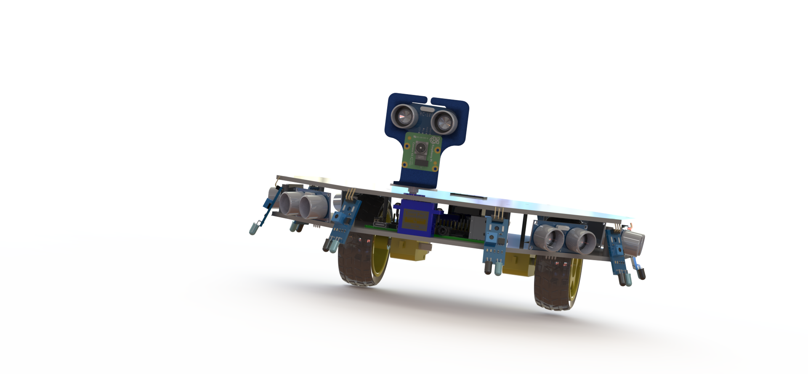

# Robot For Autonomous three Dimensional Spatial Navigation(RASN)



## Enviroment Setup

required version of python is `python3.8.6` with unity version `2021.3.15f1`

Install devlopment tool kit for unity using `visual studio installer` download from [here](https://visualstudio.microsoft.com/downloads/)

```sh
pip install virtualenv
virtualenv venv
venv\Scripts\activate.bat
pip install -r requirements.txt
```

## Running

### Traning

To start traing run this command in the root directory

```sh
mlagents-learn config\configuration.yaml --run-id=main_run --resume
```

### Tensorboard

For monitring traing process run this command in diffrent terminal with environment activated form rot directory

```sh
tensorboard --logdir=results\main_run
```

## Model

To build model install `tensorflow`, `onnx`, `onnx-tf`, and `tensorflow-probability` using this command

```sh
pip install tensorflow onnx onnx-tf && pip install --upgrade tensorflow-probability
```

To build tensorflow model form onnx use this command

```sh
onnx-tf convert -i results\main_run\Behaviour.onnx -o model.pb
```
should result in a folder named `model.pb` with `saved_model.pb`
